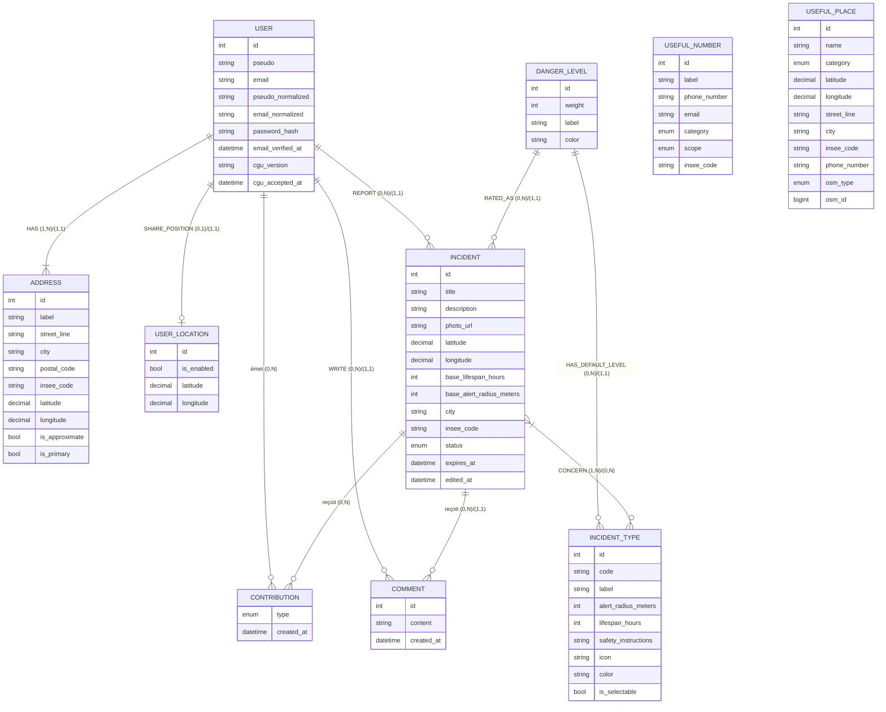
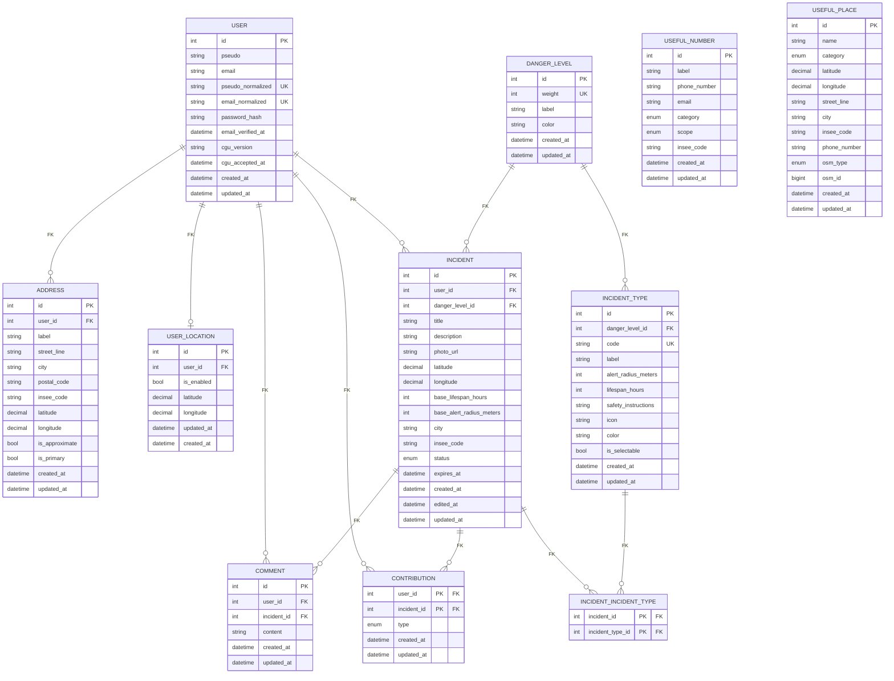

# Vigie — dossier de cadrage

> Base de référence de l'équipe. Synthétise le Miro (idéation) et le Trello (backlog affiné)
> pour orienter la conception et le développement de l'application.
>
> - Miro : https://miro.com/app/board/uXjVH26GErs=/
> - Trello : https://trello.com/b/LK4mUwrE/p3-vigie
> - Modèle de données (MCD) : https://studio.mcd-creator.com/projets/7508868f-ace5-4445-a245-6423c5d152ee
> - Wireframes : https://trello.com/c/nx08cpaQ/1-wireframes · Maquettes : https://trello.com/c/qqO1d9re/2-maquettes

---

## 1. Le produit

**Vigie — l'alerte entre voisins.**

Application web de signalement de risques naturels à l'échelle d'un quartier : feu, inondation,
tempête, grêle, chute d'arbre, animal sauvage, etc. Un utilisateur signale ; ses voisins dont
une adresse se trouve dans le rayon concerné sont alertés dans la minute.

**Positionnement : hyper-local.** Pas de flux national, pas de bruit. Là où les applications
existantes (feuxdeforet.fr, PyroWatch…) sont mono-risque et génériques, Vigie mise sur le
voisinage comme premier réseau d'alerte, tous risques confondus, sur une carte temps réel.

**Cadre à écrire noir sur blanc (CGU, US25) :** *Vigie prévient les voisins, mais ne contacte
pas les secours.* Le service accepte des signalements de danger sans garantir aucune intervention.

## 2. Principes directeurs

- **Contexte d'usage déterminant.** On ouvre Vigie dans l'urgence, souvent d'une main, souvent
  dehors, parfois sous stress. Chaque écran doit être lisible en trois secondes. La rapidité
  prime sur l'exhaustivité.
- **Mobile-first strict.** Le desktop est une adaptation, pas la cible.
- **On alerte par zone, pas par « quartier ».** L'utilisateur renseigne une adresse exacte ;
  à chaque signalement, tous les utilisateurs dont une adresse tombe dans le rayon du type
  d'incident sont avertis — qu'ils soient chez eux ou non.
- **La communauté pilote la durée de vie d'un incident.** Confirmer prolonge, infirmer
  raccourcit ; une tâche planifiée applique le résultat sans le réinterpréter (voir §5).
- **Consultation ouverte, contribution réservée.** La carte, la liste et les fiches sont
  accessibles sans compte (partage de lien). Signaler, commenter, confirmer/infirmer,
  gérer son profil demandent une connexion.
- **Le front n'appelle jamais directement les API tierces.** Adresse, vigilance météo, etc.
  passent par le back (« API Vigie »).

## 3. Périmètre fonctionnel

Deux versions. La **V1** est le socle livrable ; la **V2** regroupe les évolutions.
Priorité : `1` = à faire d'abord, `3` = à faire en dernier (étiquettes Trello).

### V1

| US | Intitulé | Prio | Responsable(s) | Branche |
|----|----------|------|----------------|---------|
| US00 | Initialisation du projet (stack, alias, routing, thème, layout) | — | Équipe | `feat/US00-init` |
| US01 | Signaler un incident → alerter les voisins concernés | 1 | Laurent Koehler, Julien Roussel | `feat/US01-incident-form` |
| US02 | Consulter le détail d'un incident | 1 | Frédéric Briand | `feat/US02-incident-details` |
| US03 | Accéder à la liste de tous les incidents | 2 | Guillaume Galinanes | `feat/US03-incident-list` |
| US04 | Carte interactive (incidents + lieux utiles) | 2 | Guillaume Galinanes | `feat/US04-interactive-map` |
| US05 | S'inscrire (avec adresse géolocalisée + vérification e-mail) | 2 | Laurent Koehler | `feat/US05-register` |
| US06 | Se connecter (JWT en cookie httpOnly) | 2 | Laurent Koehler | `feat/US06-login` |
| US07 | Corriger le contenu descriptif de son incident | 2 | Frédéric Briand | `feat/US07-incident-edit` |
| US08 | Consulter et commenter un incident (fil plat, citations) | 2 | Frédéric Briand | `feat/US08-incident-comments` |
| US09 | Centre de notifications in-app (pastille non lues) | 2 | Frédéric Briand | `feat/US09-notification-center` |
| US10 | Rechercher et trier les incidents (+ inclure les résolus) | 2 | Guillaume Galinanes | `feat/US10-search-sort` |
| US11 | Bandeau de vigilance météo (Météo-France) selon l'adresse | 3 | Guillaume Galinanes | `feat/US11-weather-vigilance` |
| US12 | Clôture automatique des incidents expirés (tâche planifiée) | 3 | Julien Roussel | `feat/US12-incident-expiry` |
| US13 | Liste des numéros utiles (bouton sur la Home) | 3 | Ivona Galikova | `feat/US13-emergency-numbers` |
| US14 | Confirmer / infirmer un incident (pilote la durée de vie) | 3 | Frédéric Briand | `feat/US14-incident-contributions` |
| US15 | Partager un incident (menu natif / copie de lien) | 3 | Frédéric Briand | `feat/US15-incident-share` |
| US16 | Barre de navigation fixe + gabarit commun des pages | 3 | Frédéric Briand | `feat/US16-navigation` |

### V2

| US | Intitulé | Prio | Responsable(s) | Branche |
|----|----------|------|----------------|---------|
| US17 | Bouton « Je suis en danger » / SOS (alerte gravité maximale) | 1 | Laurent Koehler, Julien Roussel | `feat/US17-emergency-alert` |
| US18 | Accéder à son profil et modifier son pseudo | 1 | Ivona Galikova, Laurent Koehler | `feat/US18-user-profile` |
| US19 | Réinitialiser son mot de passe oublié (jeton à durée limitée) | 2 | Julien Roussel | `feat/US19-password-reset` |
| US20 | Obtenir des badges (recalcul à la connexion, référentiel en base) | 2 | Frédéric Briand | `feat/US20-user-badges` |
| US21 | Web Push + PWA installable (alertes navigateur fermé) | 3 | Frédéric Briand | `feat/US21-web-push` |
| US22 | S'inscrire / se connecter avec un compte tiers (Google…) | 3 | Julien Roussel | `feat/US22-oauth-login` |
| US23 | Alerter selon la position live partagée (opt-in) | 3 | Laurent Koehler, Julien Roussel | `feat/US23-live-position-alert` |
| US24 | Gérer plusieurs adresses depuis le profil | 3 | Laurent Koehler | `feat/US24-manage-addresses` |
| US25 | Pages légales publiques (mentions, confidentialité, CGU) | 3 | À affecter | `feat/US25-legal-pages` |
| US26 | Consulter la liste de ses propres signalements | — | À affecter | `feat/US26-my-incidents` |

> Chaque carte Trello porte le contexte complet, le parcours nominal et les parcours
> alternatifs. Ce tableau est un index : se référer à la carte avant d'ouvrir une branche.

### Priorités issues du Miro (idéation)

- **À FAIRE ABSOLUMENT** : signalement, alerte de zone, géolocalisation, types d'incident
  détaillés, cycle de vie (actif / résolu / expiré) + auto-expiration, liste/tableau des
  signalements, inscription + connexion, numéros utiles + gestes de sécurité, e-mail aux
  concernés, RGPD / CGU / mentions légales, données fictives.
- **ÇA SERAIT BIEN** : carte interactive (Leaflet), confirmation par voisin type Waze,
  bouton « je suis en danger », fil d'actu / commentaires par alerte, bandeau vigilance
  Météo-France, notifications in-app, écran profil, partage réseaux sociaux.
- **ON EST FOUS** : Web Push / PWA iPhone, badges / gamification, mesh network / MQTT,
  auto-génération de signalements via API.

## 4. Modèle de données

Reproduit d'après les cadres **MCD**, **MLD** et **MPD** du Miro. Implémentation de
référence : `server/database/schema.sql` (MySQL 8, `utf8mb4_unicode_ci`).

Le modèle a été volontairement **borné au périmètre discuté** : `notification`, `badge`,
`oauth_account`, `push_subscription` et l'auto-citation des commentaires sont écartés pour
l'instant et seront ajoutés au moment de développer les US concernées (voir §4.4).

### 4.1 MCD — modèle conceptuel

Cardinalités Merise notées sur chaque patte. `CONTRIBUTION` est une entité associative
porteuse de l'attribut `type` (elle matérialise le confirmer/infirmer d'US14).



`USEFUL_NUMBER` et `USEFUL_PLACE` sont des référentiels autonomes (aucune association) :
rattachement à un territoire par `insee_code`, jamais par clé étrangère.

### 4.2 MLD — modèle logique

Associations résolues : les `(x,N)/(x,N)` deviennent les tables de jointure
`INCIDENT_INCIDENT_TYPE` et `CONTRIBUTION` (clé primaire composée `#a + #b`).
`#` = clé étrangère.



### 4.3 MPD — modèle physique

Types MySQL relevés sur le cadre MPD (l/L = longueur ; `_` remplace les parenthèses
pour la lisibilité du diagramme).

```mermaid
erDiagram
    USER ||--o{ ADDRESS : "FK"
    USER ||--o| USER_LOCATION : "FK"
    USER ||--o{ INCIDENT : "FK"
    USER ||--o{ COMMENT : "FK"
    USER ||--o{ CONTRIBUTION : "FK"
    INCIDENT ||--o{ COMMENT : "FK"
    INCIDENT ||--o{ CONTRIBUTION : "FK"
    INCIDENT ||--o{ INCIDENT_INCIDENT_TYPE : "FK"
    INCIDENT_TYPE ||--o{ INCIDENT_INCIDENT_TYPE : "FK"
    DANGER_LEVEL ||--o{ INCIDENT : "FK"
    DANGER_LEVEL ||--o{ INCIDENT_TYPE : "FK"

    USER {
        INT_UNSIGNED id PK "NOT NULL, AUTO_INCREMENT"
        VARCHAR_30 pseudo "NOT NULL"
        VARCHAR_255 email "NOT NULL"
        VARCHAR_30 pseudo_normalized "NOT NULL, UNIQUE"
        VARCHAR_255 email_normalized "NOT NULL, UNIQUE"
        CHAR_60 password_hash "NOT NULL"
        TIMESTAMP email_verified_at "NULL"
        VARCHAR_10 cgu_version "NOT NULL"
        TIMESTAMP cgu_accepted_at "NOT NULL"
        TIMESTAMP created_at "NOT NULL, DEFAULT CURRENT_TIMESTAMP"
        TIMESTAMP updated_at "NULL, ON UPDATE CURRENT_TIMESTAMP"
    }
    ADDRESS {
        INT_UNSIGNED id PK "NOT NULL, AUTO_INCREMENT"
        INT_UNSIGNED user_id FK "NOT NULL"
        VARCHAR_50 label "NULL"
        VARCHAR_255 street_line "NOT NULL"
        VARCHAR_100 city "NOT NULL"
        CHAR_5 postal_code "NOT NULL"
        CHAR_5 insee_code "NOT NULL"
        DECIMAL_10_6 latitude "NOT NULL"
        DECIMAL_10_6 longitude "NOT NULL"
        TINYINT_1 is_approximate "NOT NULL, DEFAULT 0"
        TINYINT_1 is_primary "NOT NULL, DEFAULT 0"
        TIMESTAMP created_at "NOT NULL, DEFAULT CURRENT_TIMESTAMP"
        TIMESTAMP updated_at "NULL, ON UPDATE CURRENT_TIMESTAMP"
    }
    USER_LOCATION {
        INT_UNSIGNED id PK "NOT NULL, AUTO_INCREMENT"
        INT_UNSIGNED user_id FK "NOT NULL, UNIQUE"
        TINYINT_1 is_enabled "NOT NULL, DEFAULT 0"
        DECIMAL_10_6 latitude "NULL"
        DECIMAL_10_6 longitude "NULL"
        TIMESTAMP updated_at "NULL, ON UPDATE CURRENT_TIMESTAMP"
        TIMESTAMP created_at "NOT NULL, DEFAULT CURRENT_TIMESTAMP"
    }
    DANGER_LEVEL {
        INT_UNSIGNED id PK "NOT NULL, AUTO_INCREMENT"
        INT_UNSIGNED weight "NOT NULL, UNIQUE"
        VARCHAR_50 label "NOT NULL"
        CHAR_7 color "NOT NULL"
        TIMESTAMP created_at "NOT NULL, DEFAULT CURRENT_TIMESTAMP"
        TIMESTAMP updated_at "NOT NULL, ON UPDATE CURRENT_TIMESTAMP"
    }
    INCIDENT_TYPE {
        INT_UNSIGNED id PK "NOT NULL, AUTO_INCREMENT"
        INT_UNSIGNED danger_level_id FK "NOT NULL"
        VARCHAR_30 code "NOT NULL, UNIQUE"
        VARCHAR_60 label "NOT NULL"
        SMALLINT_UNSIGNED alert_radius_meters "NOT NULL"
        SMALLINT_UNSIGNED lifespan_hours "NOT NULL"
        VARCHAR_1000 safety_instructions "NULL"
        VARCHAR_80 icon "NOT NULL"
        CHAR_7 color "NOT NULL"
        TINYINT_1 is_selectable "NOT NULL, DEFAULT 1"
        TIMESTAMP created_at "NOT NULL, DEFAULT CURRENT_TIMESTAMP"
        TIMESTAMP updated_at "NULL, ON UPDATE CURRENT_TIMESTAMP"
    }
    INCIDENT {
        INT_UNSIGNED id PK "NOT NULL, AUTO_INCREMENT"
        INT_UNSIGNED user_id FK "NOT NULL"
        INT_UNSIGNED danger_level_id FK "NOT NULL"
        VARCHAR_150 title "NOT NULL"
        TEXT description "NULL"
        VARCHAR_255 photo_url "NULL"
        DECIMAL_10_6 latitude "NOT NULL"
        DECIMAL_10_6 longitude "NOT NULL"
        SMALLINT_UNSIGNED base_lifespan_hours "NOT NULL"
        SMALLINT_UNSIGNED base_alert_radius_meters "NOT NULL"
        VARCHAR_150 city "NOT NULL"
        CHAR_5 insee_code "NOT NULL"
        ENUM status "in_progress|resolved, NOT NULL, DEFAULT in_progress"
        TIMESTAMP expires_at "NOT NULL"
        TIMESTAMP created_at "NOT NULL, DEFAULT CURRENT_TIMESTAMP"
        TIMESTAMP edited_at "NULL"
        TIMESTAMP updated_at "NOT NULL, ON UPDATE CURRENT_TIMESTAMP"
    }
    INCIDENT_INCIDENT_TYPE {
        INT_UNSIGNED incident_id PK "FK, NOT NULL"
        INT_UNSIGNED incident_type_id PK "FK, NOT NULL"
    }
    CONTRIBUTION {
        INT_UNSIGNED user_id PK "FK, NOT NULL"
        INT_UNSIGNED incident_id PK "FK, NOT NULL"
        ENUM type "confirm|deny, NOT NULL"
        TIMESTAMP created_at "NOT NULL, DEFAULT CURRENT_TIMESTAMP"
        TIMESTAMP updated_at "NULL, ON UPDATE CURRENT_TIMESTAMP"
    }
    COMMENT {
        INT_UNSIGNED id PK "NOT NULL, AUTO_INCREMENT"
        INT_UNSIGNED user_id FK "NOT NULL"
        INT_UNSIGNED incident_id FK "NOT NULL"
        VARCHAR_1000 content "NOT NULL"
        TIMESTAMP created_at "NOT NULL, DEFAULT CURRENT_TIMESTAMP"
        TIMESTAMP updated_at "NULL, ON UPDATE CURRENT_TIMESTAMP"
    }
    USEFUL_NUMBER {
        INT_UNSIGNED id PK "NOT NULL, AUTO_INCREMENT"
        VARCHAR_100 label "NOT NULL"
        VARCHAR_20 phone_number "NOT NULL"
        VARCHAR_255 email "NULL"
        ENUM category "NOT NULL"
        ENUM scope "national|departmental|municipal, NOT NULL, DEFAULT national"
        CHAR_5 insee_code "NULL"
        TIMESTAMP created_at "NOT NULL, DEFAULT CURRENT_TIMESTAMP"
        TIMESTAMP updated_at "NULL, ON UPDATE CURRENT_TIMESTAMP"
    }
    USEFUL_PLACE {
        INT_UNSIGNED id PK "NOT NULL, AUTO_INCREMENT"
        VARCHAR_150 name "NOT NULL"
        ENUM category "NOT NULL"
        DECIMAL_10_6 latitude "NOT NULL"
        DECIMAL_10_6 longitude "NOT NULL"
        VARCHAR_255 street_line "NULL"
        VARCHAR_100 city "NULL"
        CHAR_5 insee_code "NULL"
        VARCHAR_20 phone_number "NULL"
        ENUM osm_type "node|way|relation, NULL"
        BIGINT_UNSIGNED osm_id "NULL"
        TIMESTAMP created_at "NOT NULL, DEFAULT CURRENT_TIMESTAMP"
        TIMESTAMP updated_at "NULL, ON UPDATE CURRENT_TIMESTAMP"
    }
```



**Actions référentielles (cadre MPD)**

| Clé étrangère | Cible | `ON DELETE` |
|---------------|-------|-------------|
| `address.user_id` | `user` | `CASCADE` |
| `user_location.user_id` | `user` | `CASCADE` |
| `contribution.incident_id` | `incident` | `CASCADE` |
| `contribution.user_id` | `user` | `CASCADE` |
| `incident_type.danger_level_id` | `danger_level` | `RESTRICT` |

> `schema.sql` étend ces règles aux autres FK : `incident.user_id`/`comment.*` en
> `CASCADE`, `incident.danger_level_id` et les pivots `incident_incident_type` en
> `RESTRICT`. Écart mineur relevé : le cadre MPD note `latitude` en `DECIMAL(10,6)`
> partout, `schema.sql` utilise `DECIMAL(9,6)` pour la latitude.

### 4.4 Périmètre du modèle & revue

Éléments **volontairement différés** lors de la revue du modèle (à intégrer avec l'US
correspondante, pas avant) :

- **`notification`** (US09/US12/US21) — piste retenue : remplacer la table par un
  `last_seen_at` sur `user` ; à la connexion, on recalcule ce qui est « nouveau »
  (commentaire, incident résolu, badge…). À rediscuter en équipe.
- **`badge`** + relation `earned_at` (US20) — la relation N-N est aujourd'hui sans
  attribut ; or `counter_type` / `counter_param` / `threshold` impliquent une
  progression (« 7 signalements sur 10 ») et une date d'obtention à stocker.
- **`oauth_account`** (US22) — pour l'instant, `email` + `password_hash` restent sur
  `user` ; on ajoutera la table au moment de brancher un fournisseur tiers.
- **`push_subscription`** (US21) — idem, ajoutée avec le Web Push.
- **Auto-citation des commentaires** (US08) — la relation réflexive sur `comment`
  n'est posée que si la fonctionnalité de citation est développée.

Questions ouvertes soulevées à la revue : cohérence `id` vs `user_id` sur `user`,
retrait des attributs d'authentification tant qu'ils ne sont pas cadrés, origine de
`incident_type.is_selectable`, et confirmation qu'un incident peut porter plusieurs
types (oui, d'où `incident_incident_type`).

## 5. Règles métier transverses

### Ciblage de l'alerte (US01, US23)

À la création d'un incident, le back identifie les destinataires :

1. Utilisateurs dont **une adresse** est dans le rayon du type d'incident.
2. *(V2, US23)* Utilisateurs dont la **dernière position live** non périmée est dans ce rayon.

Rayon = `alert_radius_meters` du type (aucun réglage personnalisé). Un utilisateur concerné
par plusieurs sources reçoit **une notification par source**. L'envoi est **asynchrone** :
la réponse `201` ne l'attend pas.

### Durée de vie et expiration (US01, US12, US14)

- À la création (US01), `expires_at = created_at + lifespan_hours` du type.
- À chaque confirmation / infirmation (US14), **recalcul intégral** (jamais incrémental) :

  ```
  bonus  = min(durée_base × 0,15 ; 4 h) × nb_confirmations
  malus  = durée_base × 0,25 × nb_infirmations
  durée  = durée_base + bonus − malus        (bornée entre 0 et durée_base × 2)
  expires_at = created_at + durée
  ```

- US12 est une **tâche planifiée** (`node-cron`, service `expiryService`) qui se contente de
  lire `expires_at` : elle passe en `resolved` les incidents `in_progress` échus, journalise
  le nombre clôturés, notifie les destinataires de l'alerte initiale + le créateur.
  Rejouable sans double traitement ; déclenchable manuellement pour la démo.

### Statuts d'un incident

`in_progress` → `resolved`. Pas d'autre statut. La fiche d'un incident résolu reste
consultable (archive) mais n'est plus modifiable (US07) ni commentable (US08).

### Champs figés après signalement (US07)

Type, position et gravité sont **verrouillés** dès l'envoi de l'alerte : ce sont eux qui ont
déterminé qui a été alerté, dans quel rayon et pour combien de temps. Seuls titre, description
et photo restent modifiables, et seulement tant que l'incident est `in_progress`. Une
modification ne renvoie **aucune** alerte ; la fiche indique « modifié le … ».

### Authentification (US05, US06)

- Inscription : pseudo + e-mail + mot de passe (indicateur de robustesse, pas de règle de
  composition imposée) + adresse (auto-complétion via l'API Vigie) + acceptation CGU.
  Compte créé non vérifié, e-mail de vérification envoyé.
- Connexion possible même sans e-mail vérifié ; certaines actions (US01) restent bloquées.
- Session : **JWT dans un cookie `httpOnly`**, durée fixe, sans renouvellement automatique.
- Comparaisons pseudo / e-mail sur formes **normalisées** ; messages d'erreur neutres
  (anti-énumération de comptes).

### Limites & garde-fous (issus du Miro)

Nombre maximum de signalements par utilisateur et par heure · âge minimum 15 ans ·
gravité par défaut par type · pas de suppression d'incident (archive) ni de commentaire.

## 6. Référentiels (données de seed)

### Niveaux de gravité (`danger_level`)

| Poids | Libellé | Couleur |
|-------|---------|---------|
| 1 | Faible | `#116530` |
| 2 | Modéré | `#6B8E23` |
| 3 | Important | `#C58A1E` |
| 4 | Élevé | `#D2691E` |
| 5 | Critique | `#C1392B` |

### Types d'incident (`incident_type`)

| Code | Libellé | Gravité | Rayon (m) | Durée de vie (h) | Sélectionnable |
|------|---------|---------|-----------|------------------|----------------|
| `tornado` | Tornade | 5 | 3000 | 2 | oui |
| `danger` | Danger | 5 | 1000 | 4 | **non** (réservé au SOS, US17) |
| `fire` | Feu | 4 | 2000 | 24 | oui |
| `flood` | Inondation | 4 | 2000 | 48 | oui |
| `storm` | Tempête | 4 | 3000 | 12 | oui |
| `rockfall` | Éboulement | 4 | 500 | 72 | oui |
| `hail` | Grêle | 3 | 3000 | 2 | oui |
| `glaze` | Verglas | 3 | 500 | 12 | oui |
| `wild` | Animal sauvage | 3 | 1000 | 3 | oui |
| `tree` | Chute d'arbre | 3 | 200 | 48 | oui |
| `snow` | Neige | 2 | 2000 | 24 | oui |
| `insect` | Nid d'insectes | 2 | 50 | 168 | oui |
| `animal` | Animal perdu | 1 | 1000 | 168 | oui |

Chaque type porte des **consignes de sécurité** (`safety_instructions`) affichées au
signalement (US01) et sur la fiche (US02).

### Numéros utiles nationaux (`useful_number`, seed)

112 (urgences européennes) · 18 (pompiers) · 15 (SAMU) · 17 (police secours) ·
114 (sourds et malentendants) · 196 (secours en mer) · 116 117 (médecin de garde) ·
0 800 59 00 59 (centre antipoison).

## 7. Stack technique & architecture

Monorepo JS (workspaces npm `client` + `server`), architecture React–Express–MySQL
telle qu'enseignée à la Wild Code School.

**Client** — React 19 + Vite + TypeScript · `react-router` · Tailwind CSS + DaisyUI
(primitives accessibles) · tokens de thème dans `client/src/styles/theme.css` ·
carte **Leaflet + OpenStreetMap** · icônes SVG dans `client/src/assets/icons`
(`interface/`, `nav/`, `types/`). Mobile-first strict.

**Serveur** — Node.js + Express + TypeScript · modules `xxxActions.ts` / `xxxRepository.ts` ·
`mysql2/promise` (pool) · migrations `npm run db:migrate` (depuis `server/database/schema.sql`),
seeders `npm run db:seed` (`server/database/fixtures/`) · tests Jest + Supertest ·
tâche planifiée `node-cron` (US12).

**Qualité** — **Biome 1.9.4** (lint + format, remplace ESLint/Prettier), groupe `a11y`
activable via `biome.json` · Commitlint (Conventional Commits) · `validate-branch-name` ·
git-hooks (`.git-hooks`, `core.hooksPath`).

**Commandes** — `npm run dev` (client + serveur), `npm run check` / `check:fix`,
`npm run test`, `npm run db:migrate`, `npm run db:seed`.

**Déploiement** — Docker / Docker Compose ; cible Traefik `https://${PROJECT_NAME}.<sous-domaine>.wilders.dev/`
(pas d'underscore dans le nom de projet).

## 8. Intégrations externes

Toujours proxifiées par le back (« API Vigie ») — jamais d'appel direct depuis le front.

| Usage | Source |
|-------|--------|
| Auto-complétion et géocodage d'adresses (US05, US24) | Base Adresse Nationale — `https://data.geopf.fr/geocodage/search/` |
| Contours de communes / géocodage inverse | API Carto (IGN) — `https://apicarto.ign.fr` (doc `cartes.gouv.fr`) |
| Numéros des mairies (`scope = municipal`) | Annuaire de l'administration — `https://api-lannuaire.service-public.gouv.fr/api/explore/v2.1` |
| Lieux utiles : pompiers, vétérinaires, hôpitaux, pharmacies, police (US04) | OpenStreetMap / Nominatim (d'où `useful_place.osm_type` + `osm_id`) |
| Vigilance météo par département (US11) | API Vigilance Météo-France |
| Fond de carte (US04) | Tuiles OpenStreetMap via Leaflet |

Pistes évoquées au Miro mais **non retenues** pour la V1/V2 : Firebase Cloud Messaging,
Twilio (SMS). Les alertes hors application passent par e-mail (V1) puis Web Push (US21).

## 9. Conventions (source : carte Trello « Conventions de nommage »)

**Branches** — `feat/US01-nom-court` · `fix/…` (bug) · `chore/…` (config).
Une branche par US (voir §3).

**Commits** — `(US01) message court`. Variante back si besoin de distinguer :
`(BACK-US12) message explicite`. Format Conventional Commits vérifié par Commitlint.

**Front**

| Élément | Casse | Exemple |
|---------|-------|---------|
| Page / composant + son fichier | PascalCase | `ReportCard`, `ReportCard.tsx` |
| Fichier CSS Module | PascalCase | `ReportCard.module.scss` |
| Fichier SCSS global | kebab-case | `variables.scss` |
| Classe CSS | kebab-case | `.card-title` |

> Note : la carte décrit des CSS Modules SCSS ; le projet actuel privilégie les classes
> utilitaires Tailwind/DaisyUI + les tokens de `theme.css`. À trancher en équipe et à
> refléter ici.

**SQL** — tables au pluriel et en `snake_case` (`users`, `incidents`, `incident_types`) ;
colonnes `snake_case` explicites (`default_severity`, `alert_radius_meters`,
`lifespan_hours`, `created_at` / `updated_at`) ; clés étrangères `user_id`,
`incident_type_id` ; tables pivot `incident_votes`, etc.

> Note : le schéma livré utilise le **singulier** (`user`, `incident`, `incident_type`).
> Divergence à arbitrer et à consigner ici.

**Back (Node.js / Express)** — variables & fonctions en camelCase
(`incidentData`, `getIncidentsByZone()`, `archiveExpiredIncidents()`) ;
classes & modèles en PascalCase (`IncidentController`, `GeofencingService`, `UserModel`) ;
routes API en kebab-case et au pluriel :

```
GET  /api/incidents
POST /api/incident-types
POST /api/incidents/emergency      (US17 — SOS)
```

## 10. Ressources

| Ressource | Lien |
|-----------|------|
| Miro (idéation, pitch, cadres de conception) | https://miro.com/app/board/uXjVH26GErs=/ |
| Trello (backlog affiné, US détaillées) | https://trello.com/b/LK4mUwrE/p3-vigie |
| Miro — cadre MCD | https://miro.com/app/board/uXjVH26GErs=/?moveToWidget=3458764681600763062 |
| Miro — cadre MLD | https://miro.com/app/board/uXjVH26GErs=/?moveToWidget=3458764681694627515 |
| Miro — cadre MPD | https://miro.com/app/board/uXjVH26GErs=/?moveToWidget=3458764681702455729 |
| MCD Creator (brouillon, non tenu à jour) | https://studio.mcd-creator.com/projets/7508868f-ace5-4445-a245-6423c5d152ee |
| Wireframes | https://trello.com/c/nx08cpaQ/1-wireframes |
| Maquettes | https://trello.com/c/qqO1d9re/2-maquettes |
| Conventions de nommage (carte) | https://trello.com/c/Bc5Mms9V/3-conventions-de-nommage |
| Demandes clients (comptes rendus de présentation) | https://trello.com/c/rKPx0jY3/4-demandes-clients |

---

*Ce fichier est une synthèse. En cas de doute, la carte Trello de l'US fait foi pour le
comportement attendu, et `server/database/schema.sql` pour le modèle de données.*
