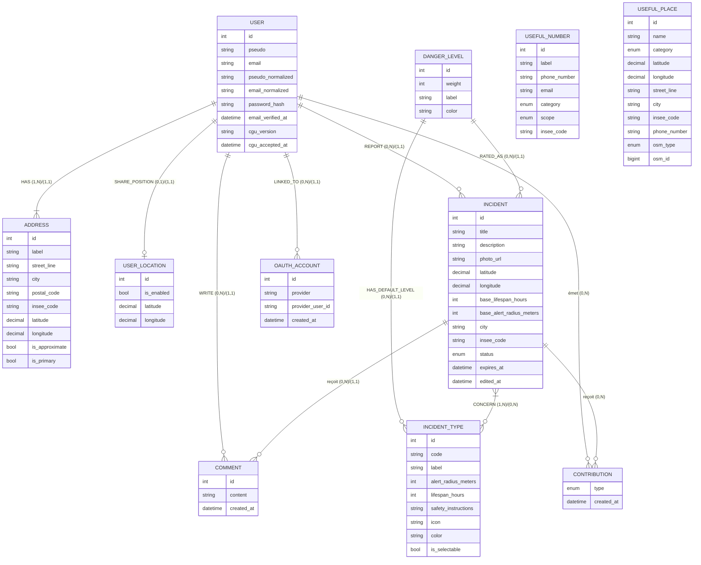
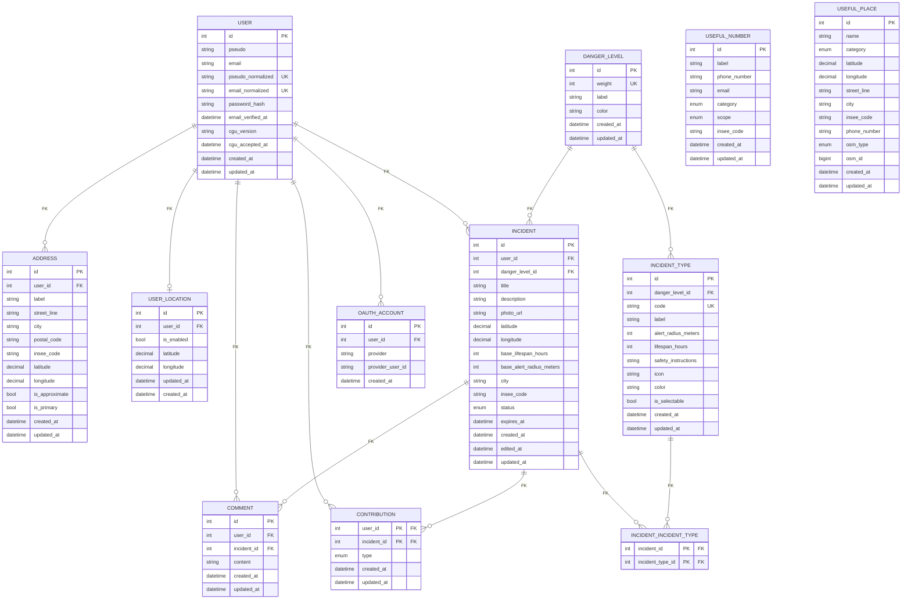

# Vigie — dossier de cadrage

> Base de référence de l'équipe. Synthétise le Miro (idéation) et le Trello (backlog affiné)
> pour orienter la conception et le développement de l'application.
>
> - Miro : https://miro.com/app/board/uXjVH26GErs=/
> - Trello : https://trello.com/b/LK4mUwrE/p3-vigie
<!-- > - Modèle de données (MCD) : en att de modification -->
> - Wireframes : https://trello.com/c/nx08cpaQ/1-wireframes · Maquettes : https://trello.com/c/qqO1d9re/2-maquettes

---

## 1. Le produit

**Vigie — l'alerte entre voisins.**

Application web de signalement de risques naturels à l'échelle d'un quartier : feu, inondation,
tempête, grêle, chute d'arbre, animal sauvage, etc. Un utilisateur signale ; ses voisins dont
une adresse se trouve dans le rayon concerné sont alertés dans la minute.

**Positionnement : hyper-local.** Pas de flux national, pas de bruit. Là où les applications
existantes (feuxdeforet.fr, PyroWatch…) sont mono-risque et génériques, Vigie mise sur le
voisinage comme premier réseau d'alerte, tous risques confondus, sur une carte temps réel.

**Cadre à écrire noir sur blanc (CGU, US25) :** *Vigie prévient les voisins, mais ne contacte
pas les secours.* Le service accepte des signalements de danger sans garantir aucune intervention.

## 2. Principes directeurs

- **Contexte d'usage déterminant.** On ouvre Vigie dans l'urgence, souvent d'une main, souvent
  dehors, parfois sous stress. Chaque écran doit être lisible en trois secondes. La rapidité
  prime sur l'exhaustivité.
- **Mobile-first strict.** Le desktop est une adaptation, pas la cible.
- **On alerte par zone, pas par « quartier ».** L'utilisateur renseigne une adresse exacte ;
  à chaque signalement, tous les utilisateurs dont une adresse tombe dans le rayon du type
  d'incident sont avertis — qu'ils soient chez eux ou non.
- **La communauté pilote la durée de vie d'un incident.** Confirmer prolonge, infirmer
  raccourcit ; une tâche planifiée applique le résultat sans le réinterpréter (voir §5).
- **Consultation ouverte, contribution réservée.** La carte, la liste et les fiches sont
  accessibles sans compte (partage de lien). Signaler, commenter, confirmer/infirmer,
  gérer son profil demandent une connexion.
- **Le front n'appelle jamais directement les API tierces.** Adresse, vigilance météo, etc.
  passent par le back (« API Vigie »).

## 3. Périmètre fonctionnel

Deux versions. La **V1** est le socle livrable ; la **V2** regroupe les évolutions.
Priorité : `1` = à faire d'abord, `3` = à faire en dernier (étiquettes Trello).
Responsables : état du Trello au 2026-10-05.

### V1

| US | Intitulé | Prio | Responsable(s) | Branche |
|----|----------|------|----------------|---------|
| US00 | Initialisation du projet (stack, alias, routing, thème, layout) | — | Équipe | `feat/US00-init` |
| US01 | Signaler un incident → alerter les voisins concernés | 1 | Laurent Koehler | `feat/US01-incident-form` |
| US02 | Consulter le détail d'un incident | 1 | Frédéric Briand | `feat/US02-incident-details` |
| US03 | Accéder à la liste de tous les incidents | 2 | Guillaume Galinanes | `feat/US03-incident-list` |
| US04 | Carte interactive (incidents + lieux utiles) | 2 | Guillaume Galinanes | `feat/US04-interactive-map` |
| US05 | S'inscrire (avec adresse géolocalisée + vérification e-mail) | 2 | Laurent Koehler | `feat/US05-register` |
| US06 | Se connecter (JWT en en-tête `Authorization: Bearer`) | 2 | Julien Roussel | `feat/US06-login` |
| US07 | Corriger le contenu descriptif de son incident | 2 | Frédéric Briand | `feat/US07-incident-edit` |
| US08 | Consulter et commenter un incident (fil plat, citations) | 2 | Frédéric Briand | `feat/US08-incident-comments` |
| US09 | Centre de notifications in-app (pastille non lues) | 2 | Julien Roussel | `feat/US09-notification-center` |
| US10 | Rechercher et trier les incidents (+ inclure les résolus) | 2 | Guillaume Galinanes | `feat/US10-search-sort` |
| US11 | Bandeau de vigilance météo (Météo-France) selon l'adresse | 3 | Ivona Galikova | `feat/US11-weather-vigilance` |
| US12 | Clôture automatique des incidents expirés (tâche planifiée) | 3 | Frédéric Briand | `feat/US12-incident-expiry` |
| US13 | Liste des numéros utiles (bouton sur la Home) | 3 | Ivona Galikova | `feat/US13-emergency-numbers` |
| US14 | Confirmer / infirmer un incident (pilote la durée de vie) | 3 | Frédéric Briand | `feat/US14-incident-contributions` |
| US15 | Partager un incident (menu natif / copie de lien) | 3 | Frédéric Briand | `feat/US15-incident-share` |
| US16 | Barre de navigation fixe + gabarit commun des pages | 3 | Julien Roussel | `feat/US16-navigation` |
| US27 | Ajouter une photo à son signalement depuis son téléphone (vrai upload) | 3 | Frédéric Briand | `feat/US27-photo-upload` |

> **US27 est transverse** : elle remplace, pour US01 (création) et US07 (édition), le repli actuel
> — un simple champ URL — par un vrai import de fichier (redimensionnement, EXIF, stockage,
> validation MIME/taille). US01 et US07 restent finissables et livrables sans elle (photo
> optionnelle / repli URL déjà couverts par leurs propres critères d'acceptation) ; US27 vient
> ensuite compléter les deux. Composant partagé déjà livré par US07 :
> `client/src/components/Form/PhotoField/PhotoField.tsx`.

### V2

| US | Intitulé | Prio | Responsable(s) | Branche |
|----|----------|------|----------------|---------|
| US17 | Bouton « Je suis en danger » / SOS (alerte gravité maximale) | 1 | Laurent Koehler | `feat/US17-emergency-alert` |
| US18 | Accéder à son profil et modifier son pseudo | 1 | Laurent Koehler | `feat/US18-user-profile` |
| US19 | Réinitialiser son mot de passe oublié (jeton à durée limitée) | 2 | Julien Roussel | `feat/US19-password-reset` |
| US20 | Obtenir des badges (recalcul à la connexion, référentiel en base) | 2 | Frédéric Briand | `feat/US20-user-badges` |
| US21 | Web Push + PWA installable (alertes navigateur fermé) | 3 | Frédéric Briand | `feat/US21-web-push` |
| US22 | S'inscrire / se connecter avec un compte tiers (Google…) | 3 | Julien Roussel | `feat/US22-oauth-login` |
| US23 | Alerter selon la position live partagée (opt-in) | 3 | Laurent Koehler, Julien Roussel | `feat/US23-live-position-alert` |
| US24 | Gérer plusieurs adresses depuis le profil | 3 | Laurent Koehler | `feat/US24-manage-addresses` |
| US25 | Pages légales publiques (mentions, confidentialité, CGU) | 3 | À affecter | `feat/US25-legal-pages` |
| US26 | Consulter la liste de ses propres signalements | — | À affecter | `feat/US26-my-incidents` |

> Chaque carte Trello porte le contexte complet, le parcours nominal et les parcours
> alternatifs. Ce tableau est un index : se référer à la carte avant d'ouvrir une branche.

### Priorités issues du Miro (idéation)

- **À FAIRE ABSOLUMENT** : signalement, alerte de zone, géolocalisation, types d'incident
  détaillés, cycle de vie (actif / résolu / expiré) + auto-expiration, liste/tableau des
  signalements, inscription + connexion, numéros utiles + gestes de sécurité, e-mail aux
  concernés, RGPD / CGU / mentions légales, données fictives.
- **ÇA SERAIT BIEN** : carte interactive (Leaflet), confirmation par voisin type Waze,
  bouton « je suis en danger », fil d'actu / commentaires par alerte, bandeau vigilance
  Météo-France, notifications in-app, écran profil, partage réseaux sociaux.
- **ON EST FOUS** : Web Push / PWA iPhone, badges / gamification, mesh network / MQTT,
  auto-génération de signalements via API.

## 4. Modèle de données

Reproduit d'après les cadres **MCD**, **MLD** et **MPD** du Miro. Implémentation de
référence : `server/database/schema.sql` (MySQL 8, `utf8mb4_unicode_ci`).

Le modèle a été volontairement **borné au périmètre discuté** : `badge`,
`push_subscription` et l'auto-citation des commentaires sont écartés pour l'instant et
seront ajoutés au moment de développer les US concernées (voir §4.4). `oauth_account`
a été ajoutée avec l'US22 (connexion Google).

### 4.1 MCD — modèle conceptuel

Cardinalités Merise notées sur chaque patte. `CONTRIBUTION` est une entité associative
porteuse de l'attribut `type` (elle matérialise le confirmer/infirmer d'US14).


```mermaid
erDiagram
    USER ||--|{ ADDRESS : "HAS (1,N)/(1,1)"
    USER ||--o| USER_LOCATION : "SHARE_POSITION (0,1)/(1,1)"
    USER ||--o{ INCIDENT : "REPORT (0,N)/(1,1)"
    USER ||--o{ COMMENT : "WRITE (0,N)/(1,1)"
    INCIDENT ||--o{ COMMENT : "reçoit (0,N)/(1,1)"
    DANGER_LEVEL ||--o{ INCIDENT : "RATED_AS (0,N)/(1,1)"
    DANGER_LEVEL ||--o{ INCIDENT_TYPE : "HAS_DEFAULT_LEVEL (0,N)/(1,1)"
    INCIDENT }|--o{ INCIDENT_TYPE : "CONCERN (1,N)/(0,N)"
    USER ||--o{ CONTRIBUTION : "émet (0,N)"
    INCIDENT ||--o{ CONTRIBUTION : "reçoit (0,N)"
    USER ||--o{ OAUTH_ACCOUNT : "LINKED_TO (0,N)/(1,1)"

    USER {
        int id
        string pseudo
        string email
        string pseudo_normalized
        string email_normalized
        string password_hash
        datetime email_verified_at
        string cgu_version
        datetime cgu_accepted_at
    }
    OAUTH_ACCOUNT {
        int id
        string provider
        string provider_user_id
        datetime created_at
    }
    ADDRESS {
        int id
        string label
        string street_line
        string city
        string postal_code
        string insee_code
        decimal latitude
        decimal longitude
        bool is_approximate
        bool is_primary
    }
    USER_LOCATION {
        int id
        bool is_enabled
        decimal latitude
        decimal longitude
    }
    DANGER_LEVEL {
        int id
        int weight
        string label
        string color
    }
    INCIDENT_TYPE {
        int id
        string code
        string label
        int alert_radius_meters
        int lifespan_hours
        string safety_instructions
        string icon
        string color
        bool is_selectable
    }
    INCIDENT {
        int id
        string title
        string description
        string photo_url
        decimal latitude
        decimal longitude
        int base_lifespan_hours
        int base_alert_radius_meters
        string city
        string insee_code
        enum status
        datetime expires_at
        datetime edited_at
    }
    CONTRIBUTION {
        enum type
        datetime created_at
    }
    COMMENT {
        int id
        string content
        datetime created_at
    }
    USEFUL_NUMBER {
        int id
        string label
        string phone_number
        string email
        enum category
        enum scope
        string insee_code
    }
    USEFUL_PLACE {
        int id
        string name
        enum category
        decimal latitude
        decimal longitude
        string street_line
        string city
        string insee_code
        string phone_number
        enum osm_type
        bigint osm_id
    }
```

`USEFUL_NUMBER` et `USEFUL_PLACE` sont des référentiels autonomes (aucune association) :
rattachement à un territoire par `insee_code`, jamais par clé étrangère.

### 4.2 MLD — modèle logique

Associations résolues : les `(x,N)/(x,N)` deviennent les tables de jointure
`INCIDENT_INCIDENT_TYPE` et `CONTRIBUTION` (clé primaire composée `#a + #b`).
`#` = clé étrangère.


```mermaid
erDiagram
    USER ||--o{ ADDRESS : "FK"
    USER ||--o| USER_LOCATION : "FK"
    USER ||--o{ INCIDENT : "FK"
    USER ||--o{ COMMENT : "FK"
    USER ||--o{ CONTRIBUTION : "FK"
    INCIDENT ||--o{ COMMENT : "FK"
    INCIDENT ||--o{ CONTRIBUTION : "FK"
    INCIDENT ||--o{ INCIDENT_INCIDENT_TYPE : "FK"
    INCIDENT_TYPE ||--o{ INCIDENT_INCIDENT_TYPE : "FK"
    DANGER_LEVEL ||--o{ INCIDENT : "FK"
    DANGER_LEVEL ||--o{ INCIDENT_TYPE : "FK"
    USER ||--o{ OAUTH_ACCOUNT : "FK"

    USER {
        int id PK
        string pseudo
        string email
        string pseudo_normalized UK
        string email_normalized UK
        string password_hash
        datetime email_verified_at
        string cgu_version
        datetime cgu_accepted_at
        datetime created_at
        datetime updated_at
    }
    OAUTH_ACCOUNT {
        int id PK
        int user_id FK
        string provider
        string provider_user_id
        datetime created_at
    }
    ADDRESS {
        int id PK
        int user_id FK
        string label
        string street_line
        string city
        string postal_code
        string insee_code
        decimal latitude
        decimal longitude
        bool is_approximate
        bool is_primary
        datetime created_at
        datetime updated_at
    }
    USER_LOCATION {
        int id PK
        int user_id FK
        bool is_enabled
        decimal latitude
        decimal longitude
        datetime updated_at
        datetime created_at
    }
    DANGER_LEVEL {
        int id PK
        int weight UK
        string label
        string color
        datetime created_at
        datetime updated_at
    }
    INCIDENT_TYPE {
        int id PK
        int danger_level_id FK
        string code UK
        string label
        int alert_radius_meters
        int lifespan_hours
        string safety_instructions
        string icon
        string color
        bool is_selectable
        datetime created_at
        datetime updated_at
    }
    INCIDENT {
        int id PK
        int user_id FK
        int danger_level_id FK
        string title
        string description
        string photo_url
        decimal latitude
        decimal longitude
        int base_lifespan_hours
        int base_alert_radius_meters
        string city
        string insee_code
        enum status
        datetime expires_at
        datetime created_at
        datetime edited_at
        datetime updated_at
    }
    INCIDENT_INCIDENT_TYPE {
        int incident_id PK "FK"
        int incident_type_id PK "FK"
    }
    CONTRIBUTION {
        int user_id PK "FK"
        int incident_id PK "FK"
        enum type
        datetime created_at
        datetime updated_at
    }
    COMMENT {
        int id PK
        int user_id FK
        int incident_id FK
        string content
        datetime created_at
        datetime updated_at
    }
    USEFUL_NUMBER {
        int id PK
        string label
        string phone_number
        string email
        enum category
        enum scope
        string insee_code
        datetime created_at
        datetime updated_at
    }
    USEFUL_PLACE {
        int id PK
        string name
        enum category
        decimal latitude
        decimal longitude
        string street_line
        string city
        string insee_code
        string phone_number
        enum osm_type
        bigint osm_id
        datetime created_at
        datetime updated_at
    }
```

### 4.3 MPD — modèle physique

Types MySQL relevés sur le cadre MPD (l/L = longueur ; `_` remplace les parenthèses
pour la lisibilité du diagramme).


```mermaid
erDiagram
    USER ||--o{ ADDRESS : "FK"
    USER ||--o| USER_LOCATION : "FK"
    USER ||--o{ INCIDENT : "FK"
    USER ||--o{ COMMENT : "FK"
    USER ||--o{ CONTRIBUTION : "FK"
    INCIDENT ||--o{ COMMENT : "FK"
    INCIDENT ||--o{ CONTRIBUTION : "FK"
    INCIDENT ||--o{ INCIDENT_INCIDENT_TYPE : "FK"
    INCIDENT_TYPE ||--o{ INCIDENT_INCIDENT_TYPE : "FK"
    DANGER_LEVEL ||--o{ INCIDENT : "FK"
    DANGER_LEVEL ||--o{ INCIDENT_TYPE : "FK"
    USER ||--o{ OAUTH_ACCOUNT : "FK"

    USER {
        INT_UNSIGNED id PK "NOT NULL, AUTO_INCREMENT"
        VARCHAR_30 pseudo "NOT NULL"
        VARCHAR_255 email "NOT NULL"
        VARCHAR_30 pseudo_normalized "NOT NULL, UNIQUE"
        VARCHAR_255 email_normalized "NOT NULL, UNIQUE"
        VARCHAR_255 password_hash "NULL (compte créé avec Google)"
        TIMESTAMP email_verified_at "NULL"
        VARCHAR_10 cgu_version "NOT NULL"
        TIMESTAMP cgu_accepted_at "NOT NULL"
        TIMESTAMP created_at "NOT NULL, DEFAULT CURRENT_TIMESTAMP"
        TIMESTAMP updated_at "NULL, ON UPDATE CURRENT_TIMESTAMP"
        TIMESTAMP anonymized_at "NULL (renseigné à la suppression du compte, US18)"
    }
    OAUTH_ACCOUNT {
        INT_UNSIGNED id PK "NOT NULL, AUTO_INCREMENT"
        INT_UNSIGNED user_id FK "NOT NULL, UNIQUE avec provider"
        VARCHAR_20 provider "NOT NULL"
        VARCHAR_255 provider_user_id "NOT NULL, UNIQUE avec provider"
        TIMESTAMP created_at "NOT NULL, DEFAULT CURRENT_TIMESTAMP"
    }
    ADDRESS {
        INT_UNSIGNED id PK "NOT NULL, AUTO_INCREMENT"
        INT_UNSIGNED user_id FK "NOT NULL"
        VARCHAR_50 label "NULL"
        VARCHAR_255 street_line "NOT NULL"
        VARCHAR_100 city "NOT NULL"
        CHAR_5 postal_code "NOT NULL"
        CHAR_5 insee_code "NOT NULL"
        DECIMAL_10_6 latitude "NOT NULL"
        DECIMAL_10_6 longitude "NOT NULL"
        TINYINT_1 is_approximate "NOT NULL, DEFAULT 0"
        TINYINT_1 is_primary "NOT NULL, DEFAULT 0"
        TIMESTAMP created_at "NOT NULL, DEFAULT CURRENT_TIMESTAMP"
        TIMESTAMP updated_at "NULL, ON UPDATE CURRENT_TIMESTAMP"
    }
    USER_LOCATION {
        INT_UNSIGNED id PK "NOT NULL, AUTO_INCREMENT"
        INT_UNSIGNED user_id FK "NOT NULL, UNIQUE"
        TINYINT_1 is_enabled "NOT NULL, DEFAULT 0"
        DECIMAL_10_6 latitude "NULL"
        DECIMAL_10_6 longitude "NULL"
        TIMESTAMP updated_at "NULL, ON UPDATE CURRENT_TIMESTAMP"
        TIMESTAMP created_at "NOT NULL, DEFAULT CURRENT_TIMESTAMP"
    }
    DANGER_LEVEL {
        INT_UNSIGNED id PK "NOT NULL, AUTO_INCREMENT"
        INT_UNSIGNED weight "NOT NULL, UNIQUE"
        VARCHAR_50 label "NOT NULL"
        CHAR_7 color "NOT NULL"
        TIMESTAMP created_at "NOT NULL, DEFAULT CURRENT_TIMESTAMP"
        TIMESTAMP updated_at "NOT NULL, ON UPDATE CURRENT_TIMESTAMP"
    }
    INCIDENT_TYPE {
        INT_UNSIGNED id PK "NOT NULL, AUTO_INCREMENT"
        INT_UNSIGNED danger_level_id FK "NOT NULL"
        VARCHAR_30 code "NOT NULL, UNIQUE"
        VARCHAR_60 label "NOT NULL"
        SMALLINT_UNSIGNED alert_radius_meters "NOT NULL"
        SMALLINT_UNSIGNED lifespan_hours "NOT NULL"
        VARCHAR_1000 safety_instructions "NULL"
        VARCHAR_80 icon "NOT NULL"
        CHAR_7 color "NOT NULL"
        TINYINT_1 is_selectable "NOT NULL, DEFAULT 1"
        TIMESTAMP created_at "NOT NULL, DEFAULT CURRENT_TIMESTAMP"
        TIMESTAMP updated_at "NULL, ON UPDATE CURRENT_TIMESTAMP"
    }
    INCIDENT {
        INT_UNSIGNED id PK "NOT NULL, AUTO_INCREMENT"
        INT_UNSIGNED user_id FK "NOT NULL"
        INT_UNSIGNED danger_level_id FK "NOT NULL"
        VARCHAR_150 title "NOT NULL"
        TEXT description "NULL"
        VARCHAR_255 photo_url "NULL"
        DECIMAL_10_6 latitude "NOT NULL"
        DECIMAL_10_6 longitude "NOT NULL"
        SMALLINT_UNSIGNED base_lifespan_hours "NOT NULL"
        SMALLINT_UNSIGNED base_alert_radius_meters "NOT NULL"
        VARCHAR_150 city "NOT NULL"
        CHAR_5 insee_code "NOT NULL"
        ENUM status "in_progress|resolved, NOT NULL, DEFAULT in_progress"
        TIMESTAMP expires_at "NOT NULL"
        TIMESTAMP created_at "NOT NULL, DEFAULT CURRENT_TIMESTAMP"
        TIMESTAMP edited_at "NULL"
        TIMESTAMP updated_at "NOT NULL, ON UPDATE CURRENT_TIMESTAMP"
    }
    INCIDENT_INCIDENT_TYPE {
        INT_UNSIGNED incident_id PK "FK, NOT NULL"
        INT_UNSIGNED incident_type_id PK "FK, NOT NULL"
    }
    CONTRIBUTION {
        INT_UNSIGNED user_id PK "FK, NOT NULL"
        INT_UNSIGNED incident_id PK "FK, NOT NULL"
        ENUM type "confirm|deny, NOT NULL"
        TIMESTAMP created_at "NOT NULL, DEFAULT CURRENT_TIMESTAMP"
        TIMESTAMP updated_at "NULL, ON UPDATE CURRENT_TIMESTAMP"
    }
    COMMENT {
        INT_UNSIGNED id PK "NOT NULL, AUTO_INCREMENT"
        INT_UNSIGNED user_id FK "NOT NULL"
        INT_UNSIGNED incident_id FK "NOT NULL"
        VARCHAR_1000 content "NOT NULL"
        TIMESTAMP created_at "NOT NULL, DEFAULT CURRENT_TIMESTAMP"
        TIMESTAMP updated_at "NULL, ON UPDATE CURRENT_TIMESTAMP"
    }
    USEFUL_NUMBER {
        INT_UNSIGNED id PK "NOT NULL, AUTO_INCREMENT"
        VARCHAR_100 label "NOT NULL"
        VARCHAR_20 phone_number "NOT NULL"
        VARCHAR_255 email "NULL"
        ENUM category "NOT NULL"
        ENUM scope "national|departmental|municipal, NOT NULL, DEFAULT national"
        CHAR_5 insee_code "NULL"
        TIMESTAMP created_at "NOT NULL, DEFAULT CURRENT_TIMESTAMP"
        TIMESTAMP updated_at "NULL, ON UPDATE CURRENT_TIMESTAMP"
    }
    USEFUL_PLACE {
        INT_UNSIGNED id PK "NOT NULL, AUTO_INCREMENT"
        VARCHAR_150 name "NOT NULL"
        ENUM category "NOT NULL"
        DECIMAL_10_6 latitude "NOT NULL"
        DECIMAL_10_6 longitude "NOT NULL"
        VARCHAR_255 street_line "NULL"
        VARCHAR_100 city "NULL"
        CHAR_5 insee_code "NULL"
        VARCHAR_20 phone_number "NULL"
        ENUM osm_type "node|way|relation, NULL"
        BIGINT_UNSIGNED osm_id "NULL"
        TIMESTAMP created_at "NOT NULL, DEFAULT CURRENT_TIMESTAMP"
        TIMESTAMP updated_at "NULL, ON UPDATE CURRENT_TIMESTAMP"
    }
```

**Actions référentielles (cadre MPD)**

| Clé étrangère | Cible | `ON DELETE` |
|---------------|-------|-------------|
| `address.user_id` | `user` | `CASCADE` |
| `user_location.user_id` | `user` | `CASCADE` |
| `oauth_account.user_id` | `user` | `CASCADE` |
| `contribution.incident_id` | `incident` | `CASCADE` |
| `contribution.user_id` | `user` | `CASCADE` |
| `incident_type.danger_level_id` | `danger_level` | `RESTRICT` |

> `schema.sql` étend ces règles aux autres FK : `incident.user_id`/`comment.*` en
> `CASCADE`, `incident.danger_level_id` et les pivots `incident_incident_type` en
> `RESTRICT`. Ces cascades restent définies, mais **la suppression d'un compte ne les
> déclenche pas** : la ligne `user` est anonymisée, pas effacée (voir §5, « Suppression du
> compte »). Écart mineur relevé : le cadre MPD note `latitude` en `DECIMAL(10,6)`
> partout, `schema.sql` utilise `DECIMAL(9,6)` pour la latitude.

### 4.4 Périmètre du modèle & revue

Éléments **volontairement différés** lors de la revue du modèle (à intégrer avec l'US
correspondante, pas avant) :

- **US09 — notifications in-app** — aucune table `notification` dédiée pour l'instant :
    le centre recalcule les événements visibles depuis `user.last_seen_at` (commentaire,
    incident résolu, badge) et affiche une pastille si des éléments sont non lus. La date
    est mise à jour lors de la consultation du centre. Le Web Push reste dans le périmètre
    de l'US21.
- **`badge`** + relation `earned_at` (US20) — la relation N-N est aujourd'hui sans
  attribut ; or `counter_type` / `counter_param` / `threshold` impliquent une
  progression (« 7 signalements sur 10 ») et une date d'obtention à stocker.
- **`push_subscription`** (US21) — idem, ajoutée avec le Web Push.
- **Auto-citation des commentaires** (US08) — la relation réflexive sur `comment`
  n'est posée que si la fonctionnalité de citation est développée.

Questions ouvertes soulevées à la revue : cohérence `id` vs `user_id` sur `user`,
retrait des attributs d'authentification tant qu'ils ne sont pas cadrés, origine de
`incident_type.is_selectable`, et confirmation qu'un incident peut porter plusieurs
types (oui, d'où `incident_incident_type`).

## 5. Règles métier transverses

### Notifications in-app (US09)

- Le centre est accessible aux utilisateurs connectés.
- Les événements postérieurs à `user.last_seen_at` sont considérés comme non lus.
- La pastille est affichée lorsqu'au moins un événement est non lu.
- L'ouverture du centre marque les événements affichés comme lus en mettant à jour
    `user.last_seen_at`.
- `user.last_seen_at` reste la seule frontière de lecture côté serveur, mais elle
    n'avance que globalement (bouton "Tout marquer comme lu"). Le front ajoute donc un
    état de lecture par notification, stocké en `sessionStorage` (clé
    `vigie:read-notifications`, propre à l'onglet/appareil) : sans lui, cliquer sur une
    seule notification n'avancerait pas `last_seen_at` (sinon on marquerait aussi lues
    des notifications jamais vues) et elle redeviendrait "non lue" au prochain
    chargement. Limite assumée : cet état de lecture individuel est perdu sur un autre
    appareil ou si le `sessionStorage` est vidé — `last_seen_at` reste alors la seule
    source de vérité qui persiste.
- Les notifications sont consultables dans l'application ; l'envoi navigateur lorsque
    l'application est fermée relève de l'US21.

### Ciblage de l'alerte (US01, US23)

À la création d'un incident, le back identifie les destinataires :

1. Utilisateurs dont **une adresse** est dans le rayon du type d'incident.
2. *(V2, US23)* Utilisateurs dont la **dernière position live** non périmée est dans ce rayon.

Rayon = `alert_radius_meters` du type (aucun réglage personnalisé). Pour l'**e-mail**, un
utilisateur concerné par plusieurs adresses reçoit **un e-mail par adresse** (pas de
déduplication par utilisateur). Pour les **notifications in-app**, la règle diffère : **une
seule notification par incident**, même si plusieurs adresses de l'utilisateur sont
concernées — décision prise avec le propriétaire d'US09 (2026-09-23), le centre de
notifications restant un calcul à la volée depuis `user.last_seen_at` (§4.4) plutôt qu'une
insertion par adresse dans une table dédiée. L'envoi de l'e-mail est **asynchrone** : la
réponse `201` ne l'attend pas.

### Titre et localisation du signalement (US01)

- **Titre auto-généré si laissé vide** (décision du 2026-09-09) : le serveur (pas le front)
  génère `<label du type le plus grave> à/au <commune>` (ex. « Feu à Nice », « Inondation au
  Havre ») si l'utilisateur ne saisit rien. Calculé une seule fois à la création et stocké,
  comme `base_lifespan_hours`/`base_alert_radius_meters` — jamais recalculé à la lecture.
- **Repli si aucune commune n'est trouvée** (forêt, zone rurale — décision du 2026-09-22) :
  `incident.city`/`insee_code`/`postal_code` restent `null` plutôt que de bloquer la création ;
  l'affichage retombe sur les coordonnées GPS brutes, et le titre auto-généré devient
  `<label du type> signalé(e) en dehors de l'agglomération` (accord de genre selon le type).
  Voir §4.1-4.3 : écart avec le MCD/MLD/MPD, à resynchroniser depuis Miro (non fait ici).

### Durée de vie et expiration (US01, US12, US14)

- À la création (US01), `expires_at = created_at + lifespan_hours` du type.
- À chaque confirmation / infirmation (US14), **recalcul intégral** (jamais incrémental) :

  ```
  bonus  = min(durée_base × 0,15 ; 4 h) × nb_confirmations
  malus  = durée_base × 0,25 × nb_infirmations
  durée  = durée_base + bonus − malus        (bornée entre 0 et durée_base × 2)
  expires_at = created_at + durée
  ```

- US12 est une **tâche planifiée** (`node-cron`, service `expiryService`) qui se contente de
  lire `expires_at` : elle passe en `resolved` les incidents `in_progress` échus, journalise
  le nombre clôturés, notifie les destinataires de l'alerte initiale + le créateur.
  Rejouable sans double traitement ; déclenchable manuellement pour la démo.

### Statuts d'un incident

`in_progress` → `resolved`. Pas d'autre statut. La fiche d'un incident résolu reste
consultable (archive) mais n'est plus modifiable (US07) ni commentable (US08).

### Champs figés après signalement (US07)

Type, position et gravité sont **verrouillés** dès l'envoi de l'alerte : ce sont eux qui ont
déterminé qui a été alerté, dans quel rayon et pour combien de temps. Seuls titre, description
et photo restent modifiables, et seulement tant que l'incident est `in_progress`. Une
modification ne renvoie **aucune** alerte ; la fiche indique « modifié le … ».

### Fil de commentaires (US08)

Fil plat et chronologique, consultable sans compte ; publier demande d'être connecté et que
l'incident soit `in_progress`. Un commentaire publié n'est ni modifiable ni supprimable.
**Pas de pagination** : un incident a une durée de vie limitée (`expires_at`), donc un fil reste
court en pratique — tous les commentaires s'affichent directement (décision prise à l'ouverture
d'US08, le comportement par lots initialement prévu sur la carte Trello a été retiré).
**Une seule limite de publication** : la longueur du contenu (500 caractères, `comment.content`).
Pas de limite de fréquence — la checklist Trello en prévoyait une (`checkCommentRateLimit`),
retirée à l'ouverture d'US08 pour la même raison que la pagination.
Le vrai import de fichier photo (redimensionnement, EXIF, stockage) est traité par l'US
transverse US27, commune à US01 et US07 (§3). En attendant, le champ photo reste une simple
saisie d'URL côté US07.

### Authentification (US05, US06)

- Inscription : pseudo + e-mail + mot de passe (indicateur de robustesse, pas de règle de
  composition imposée) + adresse (auto-complétion via l'API Vigie) + acceptation CGU.
  Compte créé non vérifié, e-mail de vérification envoyé.
- Connexion possible même sans e-mail vérifié ; certaines actions (US01) restent bloquées.
- Session : **JWT transporté en en-tête `Authorization: Bearer <token>`**, durée fixe (1h),
  sans renouvellement automatique. *(Révisé le 2026-09-17 : décrit précédemment comme un cookie
  `httpOnly` ; l'équipe s'est finalement alignée sur le modèle du repo pédagogique
  [`workshop-js-auth`](https://github.com/WildCodeSchool/workshop-js-auth/tree/jwt), qui utilise
  un en-tête plutôt qu'un cookie. Conséquence concrète : c'est le **front** qui doit attacher le
  token à chaque requête protégée, il n'est plus envoyé automatiquement par le navigateur.)*
- Comparaisons pseudo / e-mail sur formes **normalisées** ; messages d'erreur neutres
  (anti-énumération de comptes).

### Suppression du compte (US18)

- Accessible depuis le profil, dans une zone distincte. Une fenêtre rappelle ce qui est supprimé et
  ce qui est conservé, et indique que l'action est **irréversible**.
- **Confirmation obligatoire** : le mot de passe pour un compte qui en a un ; le pseudo, saisi à
  l'identique, pour un compte créé avec Google. Le serveur choisit selon le **compte**
  (`password_hash`), jamais selon ce qu'envoie le client. Confirmation refusée : `403`
  (`invalid_confirmation`), rien n'est modifié.
- **Supprimé définitivement** : adresses, position, liaison Google, badges.
- **Conservé de façon anonyme** : signalements, commentaires et votes (`contribution`). Écart assumé
  avec la carte Trello, qui supprimait les votes : les garder maintient les compteurs et les
  échéances des incidents cohérents. La ligne `user` reste, anonymisée
  (`anonymized_at` renseigné) : pseudo affiché « Anonyme », e-mail et pseudo normalisé
  remplacés par des valeurs dérivées de l'id, mot de passe et jetons de vérification effacés. Le
  pseudo d'origine redevient disponible.
- **Tout ou rien** : suppression des données personnelles et anonymisation dans une seule
  transaction.
- **Session** : `verifyToken` refuse (`401`) le token d'un compte supprimé, donc la session s'arrête
  immédiatement, sans attendre l'expiration du JWT (une requête par appel protégé).
- **Pseudo réservé** : « Anonyme » (sans tenir compte de la casse ni des accents) ne peut
  être choisi ni à l'inscription ni à la modification du pseudo.
- **Identité masquée** : pour un auteur supprimé, l'API renvoie `author.id: null` (signalements et
  commentaires), pour qu'on ne puisse pas relier ses publications entre elles. Les valeurs
  d'anonymisation (`@supprime-<id>`, `supprime-<id>`) sont impossibles à saisir à l'inscription, donc
  personne ne peut bloquer une suppression en les occupant à l'avance.

### Carte et lieux utiles (US04)

- **Import manuel, pas de tâche planifiée** : la table `useful_place` est remplie par
  `npm run sync:places` (script `server/bin/syncUsefulPlaces.ts`), depuis l'API Overpass
  d'OpenStreetMap, sur la France, pour les cinq catégories de l'enum. Sans argument toutes les
  catégories, sinon celles indiquées : `npm run sync:places --workspace=server -- hospital`.
  À relancer après chaque `db:migrate` (qui vide la base). Voir le README.
- **Idempotent** : un lieu = un objet OSM (`osm_type` + `osm_id`, clé unique), mis à jour au
  lieu d'être dupliqué ; écriture par lots de 1 000 lignes. Les lieux fermés
  (préfixes OSM `disused:`, `abandoned:`…) sont ignorés.
- **Overpass est public donc faillible** (2026-10-05) : deux tentatives par catégorie, avec
  pause ; une réponse vide ou partielle (`remark`) compte comme un échec et n'est jamais
  importée. Une catégorie en échec n'empêche pas les suivantes : le script finit en erreur
  (code de sortie 1) en nommant les catégories à relancer.
- **Purge sans `last_seen_at`** (2026-10-05) : après import, les lieux de la catégorie absents
  de la réponse sont supprimés, en comparant les clés OSM, sans nouvelle colonne
  (le schéma ne change pas). Garde-fou : si plus de 50 % de la catégorie serait supprimée, la
  suppression est refusée.
- **Lecture publique par zone** : `GET /api/useful-places?north&south&east&west`. Les quatre
  bornes sont obligatoires, numériques, dans les limites du globe et ordonnées
  (`south < north`, `west < east`) ; l'étendue ne dépasse pas 1°. Sinon `400 invalid_bounds`.
  Réponse limitée à 1 000 lieux. Les incidents acceptent des bornes facultatives
  (`GET /api/incidents`), avec une limite de 300 quand elles sont fournies ; des bornes
  invalides donnent aussi `400`. La réponse est `{ incidents, truncated }` : le serveur
  demande `limite + 1` lignes, en renvoie au plus `limite` et passe `truncated` à `true`
  s'il en a reçu davantage (aucune requête de comptage). Paramètres facultatifs :
  `includeResolved=true` (sinon seuls les incidents en cours et non expirés), `sort=date`
  (défaut), `date_asc`, `severity` ou `severity_asc` (valeur inconnue : date ; `severity` : plus graves d'abord), `search` (titre, description, commune
  ou libellé d'un type ; 100 caractères au plus, sinon `400 invalid_search` ; avec une
  recherche ou `includeResolved=true`, la limite par défaut passe de 15 à 100).
- **Limites connues** : pas de limitation de débit sur ces routes publiques (à décider au
  déploiement, avec `trust proxy` et la compression) ; pas d'`AbortController` côté carte
  (les réponses périmées sont ignorées) ; pas de test automatisé côté client.

### Limites & garde-fous (issus du Miro)

**5 signalements maximum par utilisateur et par heure** (`checkIncidentRateLimit`, US01,
2026-09-21) · protection anti-double-soumission : un signalement quasi identique (au moins un
type en commun, position à moins de 50 m) du même utilisateur dans les 10 secondes précédentes
est rejeté (`409`) · âge minimum 15 ans · gravité par défaut par type · pas de suppression
d'incident (archive) ni de commentaire. Exception de test : `admin1` et `admin2` (seed) ne sont
pas limités hors production — voir §7, « Comptes de test ».

## 6. Référentiels (données de seed)

### Niveaux de gravité (`danger_level`)

| Poids | Libellé | Couleur |
|-------|---------|---------|
| 1 | Faible | `#3a8f3f` |
| 2 | Modéré | `#9bbb2f` |
| 3 | Important | `#e0a81f` |
| 4 | Élevé | `#e8600f` |
| 5 | Critique | `#c1392b` |

> Ces valeurs reprennent `--level-1` … `--level-5` de `client/src/styles/theme.css`
> (source unique) ; elles alimentent la colonne `danger_level.color` au seed.

### Types d'incident (`incident_type`)

| Code | Libellé | Gravité | Rayon (m) | Durée de vie (h) | Sélectionnable |
|------|---------|---------|-----------|------------------|----------------|
| `tornado` | Tornade | 5 | 3000 | 2 | oui |
| `danger` | Danger | 5 | 1000 | 4 | **non** (réservé au SOS, US17) |
| `fire` | Feu | 4 | 2000 | 24 | oui |
| `flood` | Inondation | 4 | 2000 | 48 | oui |
| `storm` | Tempête | 4 | 3000 | 12 | oui |
| `rockfall` | Éboulement | 4 | 500 | 72 | oui |
| `hail` | Grêle | 3 | 3000 | 2 | oui |
| `glaze` | Verglas | 3 | 500 | 12 | oui |
| `wild` | Animal sauvage | 3 | 1000 | 3 | oui |
| `tree` | Chute d'arbre | 3 | 200 | 48 | oui |
| `snow` | Neige | 2 | 2000 | 24 | oui |
| `insect` | Nid d'insectes | 2 | 50 | 168 | oui |
| `animal` | Animal perdu | 1 | 1000 | 168 | oui |

Chaque type porte des **consignes de sécurité** (`safety_instructions`) affichées au
signalement (US01) et sur la fiche (US02).

### Numéros utiles nationaux (`useful_number`, seed)

112 (urgences européennes) · 18 (pompiers) · 15 (SAMU) · 17 (police secours) ·
114 (sourds et malentendants) · 196 (secours en mer) · 116 117 (médecin de garde) ·
0 800 59 00 59 (centre antipoison).

## 7. Stack technique & architecture

Monorepo JS (workspaces npm `client` + `server`), architecture React–Express–MySQL
telle qu'enseignée à la Wild Code School.

**Client** — React 19 + Vite + TypeScript · `react-router` · Tailwind CSS + DaisyUI
(primitives accessibles) · tokens de thème dans `client/src/styles/theme.css` ·
**SCSS (`sass`)** en complément pour le style particulier (voir §9) ·
carte **Leaflet + OpenStreetMap** · icônes SVG dans `client/src/assets/icons`
(`interface/`, `nav/`, `types/`). Mobile-first strict.

**Serveur** — Node.js + Express + TypeScript · modules `xxxActions.ts` / `xxxRepository.ts` ·
`mysql2/promise` (pool) · migrations `npm run db:migrate` (depuis `server/database/schema.sql`),
seeders `npm run db:seed` (`server/database/fixtures/`) · tests Jest + Supertest ·
tâche planifiée `node-cron` (US12).

**Qualité** — **Biome 1.9.4** (lint + format, remplace ESLint/Prettier), groupe `a11y`
activable via `biome.json` · Commitlint (Conventional Commits) · `validate-branch-name` ·
git-hooks (`.git-hooks`, `core.hooksPath`).

**Commandes** — `npm run dev` (client + serveur), `npm run check` / `check:fix`,
`npm run test`, `npm run db:migrate`, `npm run db:seed`.

**Déploiement** — Docker / Docker Compose ; cible Traefik `https://${PROJECT_NAME}.<sous-domaine>.wilders.dev/`
(pas d'underscore dans le nom de projet).

**Comptes de test (seed) — à nettoyer avant la mise en prod** — le seeder crée quatre
comptes `admin1` à `admin4` (mot de passe `1234`, connexion par pseudo ou `adminN@vigie.test`).
Ce sont des users ordinaires, sans rôle admin : ils servent uniquement à tester sans recréer de
comptes. Chacun reçoit une adresse et une position ; elle se règle par admin dans `server/.env`
(`SEED_ADMIN_<n>_LATITUDE` / `SEED_ADMIN_<n>_LONGITUDE`, défaut Westhalten), puis `npm run db:seed`.

Avant le déploiement :
- **ne jamais lancer `db:seed` sur la base de prod** (les comptes `admin*` y seraient créés avec `1234`) ;
- **retirer l'exemption de limite** : `admin1` et `admin2` ne sont pas soumis aux 5 signalements
  par heure (bloc `EXEMPT_PSEUDOS` dans `server/src/services/checkIncidentRateLimit.ts`). L'exemption
  est désactivée quand `NODE_ENV=production`, mais le pseudo n'est pas réservé à l'inscription :
  si l'hébergeur ne définit pas `NODE_ENV`, quelqu'un pourrait s'inscrire en `admin1` et contourner
  la limite. Supprimer le bloc, ou vérifier `NODE_ENV=production`.

## 8. Intégrations externes

Toujours proxifiées par le back (« API Vigie ») — jamais d'appel direct depuis le front.

| Usage | Source |
|-------|--------|
| Auto-complétion et géocodage d'adresses (US05, US24) | Base Adresse Nationale — `https://data.geopf.fr/geocodage/search/` |
| Contours de communes / géocodage inverse | API Carto (IGN) — `https://apicarto.ign.fr` (doc `cartes.gouv.fr`) |
| Numéros des mairies (`scope = municipal`) | Annuaire de l'administration — `https://api-lannuaire.service-public.gouv.fr/api/explore/v2.1` |
| Lieux utiles : pompiers, vétérinaires, hôpitaux, pharmacies, police (US04) | OpenStreetMap via l'API Overpass (d'où `useful_place.osm_type` + `osm_id`), importés par `npm run sync:places` (voir §5 « Carte et lieux utiles ») |
| Vigilance météo par département (US11) | API Vigilance Météo-France |
| Fond de carte (US04) | Tuiles OpenStreetMap via Leaflet |

Pistes évoquées au Miro mais **non retenues** pour la V1/V2 : Firebase Cloud Messaging,
Twilio (SMS). Les alertes hors application passent par e-mail (V1) puis Web Push (US21).

## 9. Conventions (source : carte Trello « Conventions de nommage »)

**Branches** — `feat/US01-nom-court` · `fix/…` (bug) · `chore/…` (config).
Une branche par US (voir §3).

**Commits** — `(US01) message court`. Variante back si besoin de distinguer :
`(BACK-US12) message explicite`. Format Conventional Commits vérifié par Commitlint.

**Front**

| Élément | Casse | Exemple |
|---------|-------|---------|
| Page / composant + son fichier | PascalCase | `ReportCard`, `ReportCard.tsx` |
| Fichier CSS Module | PascalCase | `ReportCard.module.scss` |
| Fichier SCSS global | kebab-case | `variables.scss` |
| Classe CSS | kebab-case | `.card-title` |

> Note : la carte décrit des CSS Modules SCSS. Direction retenue pour le projet : les
> classes utilitaires Tailwind/DaisyUI + les tokens de `theme.css` par défaut, et du
> **SCSS (`sass`)** pour le style particulier que les utilitaires ne couvrent pas
> (fichier global kebab-case type `variables.scss`, ou CSS Module `Xxx.module.scss`
> attaché à un composant). Les classes restent en kebab-case.

**SQL** — tables au pluriel et en `snake_case` (`users`, `incidents`, `incident_types`) ;
colonnes `snake_case` explicites (`default_severity`, `alert_radius_meters`,
`lifespan_hours`, `created_at` / `updated_at`) ; clés étrangères `user_id`,
`incident_type_id` ; tables pivot `incident_votes`, etc.

> Note : le schéma livré utilise le **singulier** (`user`, `incident`, `incident_type`).
> Divergence à arbitrer et à consigner ici.

**Back (Node.js / Express)** — variables & fonctions en camelCase
(`incidentData`, `getIncidentsByZone()`, `archiveExpiredIncidents()`) ;
classes & modèles en PascalCase (`IncidentController`, `GeofencingService`, `UserModel`) ;
routes API en kebab-case et au pluriel :

```
GET  /api/incidents
POST /api/incident-types
POST /api/incidents/emergency      (US17 — SOS)
```

## 10. Animations des icônes de type (US01)

Dans le formulaire de signalement, l'icône d'un type **sélectionné** s'anime en boucle
(la flamme vacille, la neige tombe…). Tout est en CSS : aucune bibliothèque, aucun
JavaScript d'animation.

### 10.1 Où se trouve quoi

| Fichier | Rôle |
|---|---|
| `client/src/styles/theme.css` | les animations : un réglage `--animate-…` + son scénario `@keyframes` |
| `client/src/components/Form/IncidentTypePicker/IncidentTypePicker.tsx` | la table `typeAnimations` : quelle classe pour quel `type.icon` |
| `client/src/assets/icons/types/*.svg` | certains SVG ont reçu des groupes `<g class="…">` pour animer une partie seulement (§10.5) |

La classe n'est ajoutée que si `isSelected` est vrai, avec `overflow-visible` pour que
l'icône puisse sortir de son cadre en bougeant.

### 10.2 Comment s'écrit une animation

Une animation, ce sont **deux morceaux** :

```css
--animate-flicker: flicker 1.2s ease-in-out infinite;   /* le réglage  */
@keyframes flicker {                                      /* le scénario */
	0%   { scale: 1 1;       rotate: 0deg; }
	25%  { scale: 0.95 1.08; rotate: -3deg; }
	/* … */
	100% { scale: 1 1;       rotate: 0deg; }
}
```

- **Le scénario (`@keyframes`)** décrit l'élément à certains moments, en pourcentage de la
  durée. Le navigateur calcule les étapes intermédiaires.
- **Le réglage** dit quel scénario jouer et comment : `nom durée rythme [délai] [infinite] [both]`.
  Quand il y a deux temps, **le premier est la durée, le second le délai**
  (`pop 1s ease 2s both` = dure 1 s, démarre après 2 s).
- **Les noms sont inventés** : `flicker` n'existe nulle part ailleurs. Le nom du `@keyframes`
  et celui écrit dans le réglage doivent être identiques. Le nom après `--animate-` devient
  la classe Tailwind (`--animate-flicker` → `animate-flicker`) ; on garde le même nom
  partout par convention.
- **Un scénario peut servir plusieurs fois** avec des réglages différents :
  `--animate-flicker-inner: flicker 0.8s ease-in-out infinite reverse;` (plus rapide, à l'envers),
  `--animate-impact: shiver 1.5s linear 1.7s;` (le tremblement du verglas, une fois, avec délai).
- **Rythme** : `linear` (vitesse constante), `ease-in` (accélère), `ease-out` (ralentit),
  `ease-in-out` (doux aux deux bouts).
- **`theme.css` n'a pas besoin d'être importé** dans le composant : il est chargé une fois
  pour toute l'app (`App.tsx` → `index.css` → `theme.css`), et le CSS est global.
- Propriétés utilisées : `rotate`, `scale: X Y`, `translate: X Y`, `opacity`. Pour l'inclinaison,
  il n'existe pas de propriété séparée : `transform: skewX(…)` (tornade).

### 10.3 Pourquoi une table et pas `animate-${type.icon}`

Tailwind ne génère que les classes **écrites en entier** dans le code : il lit le texte des
fichiers, il n'exécute pas le JavaScript. Une classe construite (`` `animate-${x}` ``) n'est
jamais générée. D'où la table `typeAnimations`, où chaque classe est écrite en toutes lettres.

### 10.4 Animer l'intérieur d'un SVG

`<Icon>` ne reçoit qu'un `className`, celui du `<svg>`. Pour atteindre une partie, on donne une
`class` à un groupe dans le fichier SVG (`vite-plugin-svgr` la conserve), puis on la vise avec
une **variante arbitraire** :

```
motion-safe:[&_.flame-inner]:animate-flicker-inner
```

`&` = l'élément lui-même (le `<svg>`), `_` = un espace (« à l'intérieur de »), `.flame-inner` =
la classe visée. Tailwind génère `.cette-classe .flame-inner { animation: … }`.

**Les pièges rencontrés :**

- **Le point de pivot dans un SVG.** Par défaut, une partie de SVG tourne ou grandit autour du
  coin haut-gauche **du dessin entier**. Il faut `[transform-box:fill-box]` (référence = la
  boîte de la forme elle-même) + un `origin-…` (`origin-bottom`, `origin-center`…). Inutile
  quand c'est le `<svg>` entier qui bouge (verglas, éboulement) : lui a une vraie boîte.
- **Ce qui dépasse est coupé.** Un SVG masque ce qui sort de son `viewBox` : une flamme étirée
  perdait sa pointe. D'où `overflow-visible` sur les icônes sélectionnées. Exception :
  l'inondation, qui doit au contraire couper (`overflow-hidden!`, le `!` rend la classe prioritaire).
- **`translate` à l'intérieur d'un SVG se mesure en unités du dessin**, pas en pixels d'écran :
  un dessin de 512 unités affiché sur 64 px → 8 unités par pixel.
- **`motion-safe:`** : l'animation ne se joue que si l'utilisateur n'a pas demandé de réduire
  les animations. Sous Windows, si *Paramètres → Accessibilité → Effets visuels → Effets
  d'animation* est désactivé, **aucune animation ne s'affiche** : penser à le vérifier avant de
  chercher un bug. `motion-reduce:` fait l'inverse (ex. : cacher le météore, §10.7).
- **Délai ou durée par partie** (`[&_.tier-2]:[animation-delay:0.15s]`) : la ligne `animation`
  remet délai et durée à zéro. Ça fonctionne parce que Tailwind écrit ces règles **après**
  celle de l'animation (vérifié dans le CSS généré). Si un jour toutes les parties bougent en
  même temps, c'est cet ordre qui a changé.
- **Formater un SVG** : VS Code ne le fait pas seul. Basculer le langage du fichier en HTML puis
  Shift+Alt+F, ou installer l'extension XML de Red Hat.

### 10.5 Découper un SVG

Un `<path>` peut contenir **plusieurs formes** : chacune commence par un `M` (« move to »).
Les 9 gouttes de la tempête, par exemple, étaient une seule forme. Pour les animer séparément :


- **Couper au niveau des `M` majuscules** : un `M` majuscule est une coordonnée absolue, la
   forme est autonome ; on la copie dans son propre `<path>` (même `fill`). Un `m` minuscule
   au milieu du tracé est relatif à la forme précédente : il faut d'abord convertir en absolu.
- **Regrouper** les morceaux d'une même partie (forme + son ombre) dans un `<g class="…">`.
- **Réordonner change la superposition** : dans un SVG, ce qui est écrit en dernier est
  dessiné par-dessus. Réordonner n'est sûr que si les formes ne se chevauchent pas.
- **Vérifier visuellement** : un rendu de l'image au repos, puis avec une partie déplacée
  (Chrome en ligne de commande : `chrome --headless --screenshot=x.png fichier.svg`).

Modifications faites, icône par icône :

| Icône | Modification du SVG | Animation |
|---|---|---|
| `fire` | 3 paths rouges → `flame-outer`, 2 jaunes → `flame-inner` | `flicker` et `flicker-inner` (même scénario, plus rapide et inversé) |
| `glaze` | aucune | `shiver` : frisson puis pause |
| `rockfall` | aucune | `topple` : penche, oscille, se stabilise (pivot en bas) |
| `wild` | les 4 derniers paths (nez + narines) → `snout` | `headshake` + `sniff`, même durée, le groin renifle pendant la pause de la tête |
| `tree` | paths réordonnés (tronc d'abord), chaque étage (forme + moitié foncée) → `tier tier-1..3` | `sway`, décalé par étage (`animation-delay`) |
| `insect` | les 2 paths des ailes → `wings` | `flutter` (ailes rétrécies en largeur depuis le centre : pas besoin de séparer gauche et droite) + `float` |
| `animal` | `class="eyes"` directement sur le path des yeux ; **la queue faisait partie du contour du corps** : contours recalculés en coordonnées absolues, corps et ombre coupés à la base de la queue, nouveau groupe `tail` dessiné derrière le corps et prolongé un peu à l'intérieur pour cacher la couture | `tail-wag` + double `blink` |
| `storm` | `bolt` sur l'éclair ; les 9 gouttes (une seule forme) → 3 rangées `drops drops-1..3` | `flash` (éclair caché entre deux éclats) + `rain` en cascade |
| `hail` | 5 grêlons répartis dans 2 paths → `stone stone-1..5` (celui du centre = un morceau clair + un foncé) | `fall`, une **durée** différente par grêlon pour ne jamais se resynchroniser |
| `snow` | les 2 gros flocons (une forme) et les 4 boules (cercle + ombre séparée) → `flake flake-1..6` | `snowfall` avec rotation de 60° : un flocon à 6 branches est identique à lui-même, la boucle est invisible |
| `flood` | chaque couche dupliquée à ±64 unités (« tapis roulant ») ; le fond foncé reçoit la classe de la couche claire car son bord haut a la même forme ; `bubble bubble-1..3` | `wave-left` / `wave-right` d'une longueur de vague (16 unités), en sens opposés + `bubble` |
| `tornado` | entonnoir, rayures et ombres → `funnel` ; les 4 traits → `debris debris-1..4` | `twist` (`skewX`, pointe fixe au sol) + `debris` décalés |

**Couleurs corrigées au passage** : les gouttes de `storm` et les rayures de `tornado` étaient
noires, alors que le SVG prévoyait du bleu / du marron sur le groupe : un `fill="#000000"` sur
chaque path écrasait la couleur du groupe. Remplacé par la couleur prévue.

### 10.6 Astuces de scénario

- **Boucle sans saut** : 0 % et 100 % identiques.
- **Pause** : tout le mouvement au début, puis une étape immobile regroupée
  (`30%, 100% { translate: 0; }`). Inversé pour le clignement (yeux ouverts jusqu'à 86 %).
- **Maintien** : deux étapes de même valeur (`10%, 35% { rotate: -8deg; }`).
- **Synchroniser deux animations** : même durée, mouvements placés à des moments différents
  (le sanglier secoue la tête de 0 à 40 %, renifle de 55 à 75 %).
- **Balancier fluide** : écrire `0% = -6°, 50% = +6°, 100% = -6°`, pas `0 → -6 → 0 → +6 → 0` ;
  avec `ease-in-out`, la seconde forme freine au passage par le centre et paraît saccadée.
  Pour un balancement continu, `linear` est souvent plus fluide.
- **Boucle invisible par symétrie** : déplacer d'exactement une période du motif (une vague,
  60° pour un flocon).

### 10.7 Bonus : la surprise « Apocalypse »

Quand **tous** les types sont sélectionnés, la grille est remplacée par
`components/Form/ApocalypseSurprise` : un météore tombe en diagonale et explose, le bloc tremble,
puis le titre et enfin le badge Apocalypse (`/badges-png/07-apocalypse.png`) apparaissent
(chute 2 s, tremblement à 1,7 s, titre à 2 s, badge à 3 s). Un clic
ramène la grille **sans rien décocher**.

- **État `isApocalypseDismissed`** dans `IncidentTypePicker` : la condition « tous cochés » reste
  vraie après le clic, il faut donc retenir que la surprise a été écartée. Remis à `false` dans
  `toggleType`, pour qu'elle se rejoue si l'on décoche puis recoche.
- **Icône `interface/meteor.svg`** dessinée pour l'occasion, sur le modèle du badge (le badge est
  un PNG : impossible d'en extraire le météore).
- **`both` (`animation-fill-mode`)** : pendant le délai, l'élément applique déjà l'étape 0 %
  (le badge reste caché à `scale: 0`) ; après la fin, il garde l'étape 100 % (le météore reste
  effacé). Sans `both`, le badge serait visible avant son « pop ».
- **Superposition** : parent `relative` de taille fixe, météore et badge en `absolute inset-0`.
- **Accessibilité** : c'est un `<button>` (pas de `<h2>` à l'intérieur, interdit en HTML, d'où
  un `<span>` stylé) ; images en `aria-hidden` ; `motion-reduce:hidden` sur le météore pour
  qu'il ne reste pas affiché par-dessus le badge quand les animations sont désactivées.

### 10.8 Lexique des noms d'animation

`flicker` vaciller · `shiver` frissonner · `topple` basculer · `headshake` secouer la tête ·
`sniff` renifler · `sway` se balancer · `flutter` battre des ailes · `float` flotter ·
`blink` cligner · `tail-wag` remuer la queue · `flash` éclair · `rain` pluie · `fall` chute ·
`snowfall` chute de neige · `wave-left` / `wave-right` vague · `bubble` bulle · `twist` se tordre ·
`debris` débris · `meteor-fall` chute du météore · `impact` / `badge-pop` / `title-pop` (réglages
de `shiver` et `pop`).

## 11. Ressources

| Ressource | Lien |
|-----------|------|
| Miro (idéation, pitch, cadres de conception) | https://miro.com/app/board/uXjVH26GErs=/ |
| Trello (backlog affiné, US détaillées) | https://trello.com/b/LK4mUwrE/p3-vigie |
| Miro — cadre MCD | https://miro.com/app/board/uXjVH26GErs=/?moveToWidget=3458764681600763062 |
| Miro — cadre MLD | https://miro.com/app/board/uXjVH26GErs=/?moveToWidget=3458764681694627515 |
| Miro — cadre MPD | https://miro.com/app/board/uXjVH26GErs=/?moveToWidget=3458764681702455729 |
| MCD Creator (brouillon, non tenu à jour) | https://studio.mcd-creator.com/projets/7508868f-ace5-4445-a245-6423c5d152ee |
| Wireframes | https://trello.com/c/nx08cpaQ/1-wireframes |
| Maquettes | https://trello.com/c/qqO1d9re/2-maquettes |
| Conventions de nommage (carte) | https://trello.com/c/Bc5Mms9V/3-conventions-de-nommage |
| Demandes clients (comptes rendus de présentation) | https://trello.com/c/rKPx0jY3/4-demandes-clients |

---

*Ce fichier est une synthèse. En cas de doute, la carte Trello de l'US fait foi pour le
comportement attendu, et `server/database/schema.sql` pour le modèle de données.*
